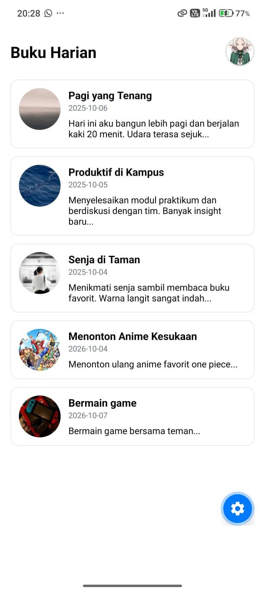

# 📔 Diary App

Aplikasi mobile untuk mencatat dan melihat kembali momen-momen berharga dalam bentuk buku harian digital.

## 👤 Informasi Mahasiswa

Proyek ini dibuat sebagai bagian dari tugas perkuliahan:
- **Nama** : Naufal Alexander
- **NIM** : 2430511010
- **Mata Kuliah** : Pemrograman Mobile Multiplatform
- **Semester** : 5

## 📱 Bukti Berjalan di Perangkat



## 🎯 Tentang Aplikasi

**Diary App** adalah aplikasi mobile yang memungkinkan pengguna untuk membaca dan mengelola catatan harian mereka. Setiap entry dilengkapi dengan mood indicator, judul, tanggal, dan preview teks untuk pengalaman pengguna yang intuitif.

Aplikasi ini dibangun menggunakan **React Native** dan **Expo**, memastikan kompatibilitas lintas platform (iOS, Android, dan Web).

## 🎨 Tema Aplikasi & UI

- **Color Scheme**: Light theme dengan warna netral.
- **Komponen Utama**: Card-based layout dengan *border* dinamis menyesuaikan mood (Senang, Fokus, Tenang, Semangat, Santai).
- **Header**: Teks "Buku Harian" dilengkapi dengan Avatar Pengguna.
- **Card Entry**: Menampilkan Mood Image (64x64px circular), Judul, Tanggal, dan Preview Catatan (maksimal 3 baris).

## 🏗️ Struktur Proyek

```text
diary-app/
├── App.js                          # Root component
├── src/
│   ├── screens/
│   │   └── DiaryListScreen.js      # Main screen - menampilkan list diary & avatar
│   └── components/
│       └── DiaryCard.js            # Reusable card component untuk setiap entry
├── assets/                         # Asset gambar lokal (Avatar, Mood, dll)
├── app.json                        # Expo configuration
├── package.json                    # Dependencies
└── README.md                       # Dokumentasi
```

## 🛠️ Tech Stack

| Technology | Fungsi |
|-----------|--------|
| **React Native** | Cross-platform mobile framework |
| **Expo** | Development & deployment platform |
| **expo-status-bar** | Status bar management |
| **react-native-safe-area-context** | Safe area handling |

## 🚀 Cara Menjalankan

### Prerequisites
Pastikan Anda sudah menginstal Node.js dan Expo CLI.

### Development

```bash
# Install dependencies
npm install

# Jalankan di development server
npx expo start

# Tekan 'a' untuk membuka di Android emulator/device
# Tekan 'i' untuk membuka di iOS simulator
```

## 🎯 Pengembangan Selanjutnya

Fitur yang dapat ditambahkan di masa mendatang:
- [ ] Tambah entry baru (form & validation)
- [ ] Edit & delete entry
- [ ] Local storage/database (AsyncStorage atau SQLite)
- [ ] Dark mode support